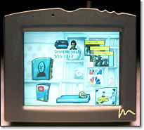

// ---
// layout: master
// title: Java 8 et l'IOT
// ---

= présentation des fonctionnalités Java8 pour l'internet des Objets

Java 8 est connu pour ses Lambda,

mais il recèle des nouveautés pour le monde de l'embarqué,

et particulièrement pour l'internet des objets.

== Plan

* histoire
* Java SE
* Java Embeded
* Java ME
* L'avenir

== Back to the future

 

== Back to the future

 

== Back to the future

 

* montre
* lunette
* voiture
* ...
et Java dans tous ça ?

== Les plate-formes Java

Jusqu'à Java 7

== Java Card pour la carte à puce
* Java ME (MidP, CLDC, CDC) pour le mobile
* Personnal Java pour le SmartPhone (hors Android et IOS) 
* Java SE pour le Desktop
* Java EE pour les serveurs

== Java SE8 pour l'IOT ?

Pas adapté aux objets connectés

nécessite un OS, généralement une couche graphique.

Lourd (140 Mo)

== Java SE8

Pas encore Jigsaw

Mais l'instruction de la notion de profils, qui permet un sous découpage de la VM

 

== Java SE8 compact profils

[options="header,footer"]
|=======
| compact1                    | compact2                   | compact3
| java.io                     | java.rmi                   | java.lang.instrument
| java.lang                   | java.rmi.activation        | java.lang.management
| java.lang.annotation        | java.rmi.registry          | java.security.acl
| java.lang.invoke            | java.rmi.server            | java.util.prefs
| java.lang.ref               | java.sql                   | javax.annotation.processing
| java.lang.reflect           | javax.rmi.ssl              | javax.lang.model
| java.math                   | javax.sql                  | javax.lang.model.element
| java.net                    | javax.transaction          | javax.lang.model.type
| java.nio                    | javax.transaction.xa       | javax.lang.model.util
| java.nio.channels           | javax.xml                  | javax.management
| java.nio.channels.spi       | javax.xml.datatype         | javax.management.loading
| java.nio.charset            | javax.xml.namespace        | javax.management.modelbean
| java.nio.charset.spi        | javax.xml.parsers          | javax.management.monitor
| java.nio.file               | javax.xml.stream           | javax.management.openmbean
| java.nio.file.attribute     | javax.xml.stream.events    | javax.management.relation
| java.nio.file.spi           | javax.xml.stream.util      | javax.management.remote
| java.security               | javax.xml.transform        | javax.management.remote.rmi
| java.security.cert          | javax.xml.transform.dom    | javax.management.timer
| java.security.interfaces    | javax.xml.transform.sax    | javax.naming
| java.security.spec          | javax.xml.transform.stax   | javax.naming.directory
| java.text                   | javax.xml.transform.stream | javax.naming.event
| java.text.spi               | javax.xml.validation       | javax.naming.ldap
| java.util                   | javax.xml.xpath            | javax.naming.spi
| java.util.concurrent        | org.w3c.dom                | javax.script
| java.util.concurrent.atomic | org.w3c.dom.bootstrap      | javax.security.auth.kerberos
| java.util.concurrent.locks  | org.w3c.dom.events         | javax.security.sasl
| java.util.jar               | org.w3c.dom.ls             | javax.sql.rowset
| java.util.logging           | org.xml.sax                | javax.sql.rowset.serial
| java.util.regex             | org.xml.sax.ext            | javax.sql.rowset.spi
| java.util.spi               | org.xml.sax.helpers        | javax.tools
| java.util.zip               |                            | javax.xml.crypto
| javax.crypto                |                            | javax.xml.crypto.dom
| javax.crypto.interfaces     |                            | javax.xml.crypto.dsig
| javax.crypto.spec           |                            | javax.xml.crypto.dsig.dom
| javax.net                   |                            | javax.xml.crypto.dsig.keyinfo
| javax.net.ssl               |                            | javax.xml.crypto.dsig.spec
| javax.security.auth         |                            | org.ieft.jgss
| javax.security.auth.callback||
| javax.security.auth.login||
| javax.security.auth.spi||
| javax.security.auth.x500||
| javax.security.cert||
|=======

== Java SE8 Compact Profil 1

[démo OSGI](https://youtu.be/TCaBno_Euqk)

video::TCaBno_Euqk[youtube]

== Les plate-formes Java Embedded

 

== JSE Embedded

[cols="2,2,5a"]
|===
|Firefox
|Browser
|Mozilla Firefox is an open-source web browser.

It's designed for:

* standards compliance
* performance
* portability

http://getfirefox.com[Get Firefox]!
|===

|=========
| | Java ME Embedded | Java SE for Embedded
|Java APIs|CLDC 8, MEEP 8, Device IO APIs, Additional Optional APIs|Full featured Java SE 8 API support
|Min Memory requirements: RAM + Flash|128KB RAM / 1MB Flash – for the smallest profile|Total: 10.4MB (Headless) – for the smallest profile
|Min MHz|30MHz|200MHz
|Target Segments|Small embedded (resource-constrained) devices|Mid to High embedded devices
|Sample Devices/Use|Cases Mobile/Feature Handsets, Digital Pen, Sensors|Industrial automation/equipments, Highend Network Appliances/Printing Devices, Medial, Aerospace and Defence, Smart Grid/ Kiosks
|Available Ports|

* ARM Cortex-M3/M4 on KEIL MCBSTM32F200
* ARM11 on Raspberry Pi
* Qualcomm M2M product family (based on ARM9)
* Custom ports available through Java Engineering Services|

OS:

* Linux,
* Windows

Processors: 

* ARM v5/6/7,
* PowerPC,
* X86

|=========

//

== JME

RIP Nokia !

Symbian est &#x1f507; aphone

Java + SmartPhone = Android ?

== JME8

JME8 = IOT

 
 

== JME8

 

== Avantages Java ME8

+ alignement Java SE8/Java ME8
    - Stream
    - Lambda
    - Event/Listener
    - Les Enums
+ Taille réduite :
    - 128 KB RAM 
    - 1 MB de Flash/ROM

== Avantages Java ME8

Gestion

* des accès :
    + GPIOs
    + Analog to Digital Converter (ADC)
    + Digital to Analog Converter (DAC)
    + ...
* des ports de communications :
    + SPI (MSIO)
    + I2C
    + UART
* Connectivité :
    + 3GPP (3rd Generation Partnership Project)
    + CDMA (Code division multiple access)
    + WiFi (Wireless Fidelity)
* New APIs for RESTful programming
    + JSON API
    + Async HTTP API
    + OAuth 2.0 AP

== Java Card

* Assure la sécurité des Objets connectées
* Possibilité de mettre des cartes à puces soudées dans les objets connectés

== Java dans le Cloud

* Big data
* Machine Learning

== Conclusion

Quid de l'avenir ?

Java 9

* Jigsaw
* Precompilateur
* Value Object
* ...

A quand du Java sur Arduino

