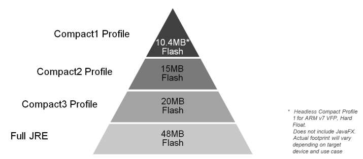
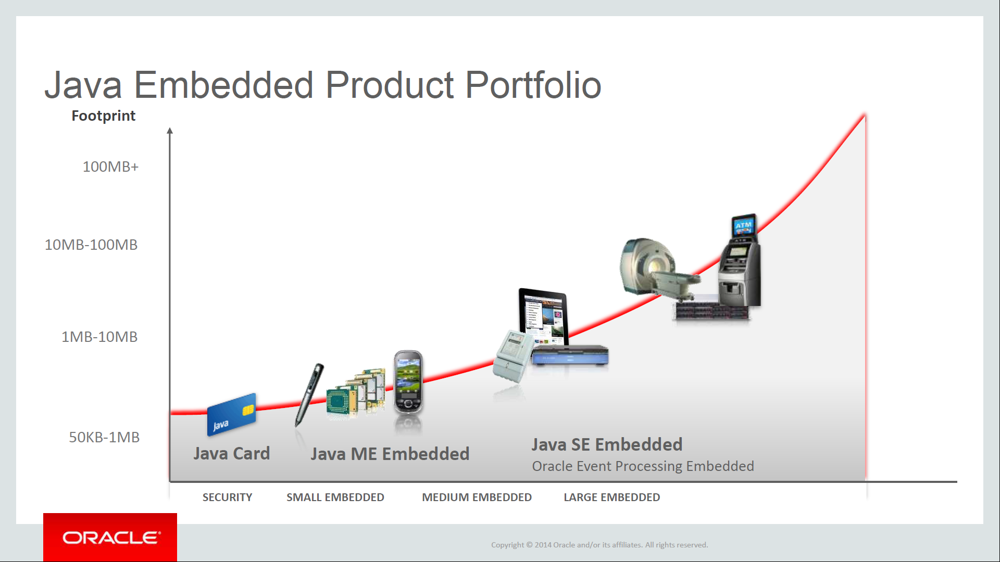
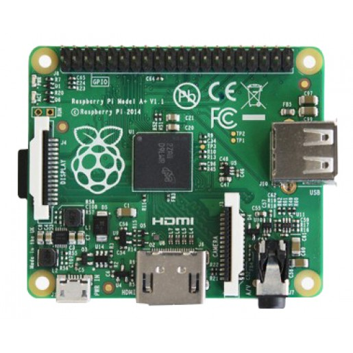

// ---
// layout: master
// title: Java 8 et l'IOT
// ---

= présentation des fonctionnalités Java8 pour l'internet des Objets

Java 8 est connu pour ses Lambda,

mais il recèle des nouveautés pour le monde de l'embarqué,

et particulièrement pour l'internet des objets.

== Plan

* histoire
* Java SE
* Java Embeded
* Java ME
* L'avenir

== Back to the future

image::images/BackToTheFuture.jpg[Java ?]

== Back to the future

image::images/Star7.jpg[Java et Star7]

== Back to the future

image::images/BackToTheFuture.jpg[Soyons sérieux]

* montre
* lunette
* voiture
* ...
et Java dans tous ça ?

== Les plate-formes Java

Jusqu'à Java 7

== Java Card pour la carte à puce
* Java ME (MidP, CLDC, CDC) pour le mobile
* Personnal Java pour le SmartPhone (hors Android et IOS) 
* Java SE pour le Desktop
* Java EE pour les serveurs

== Java SE8 pour l'IOT ?

Pas adapté aux objets connectés

nécessite un OS, généralement une couche graphique.

Lourd (140 Mo)

== Java SE8

Pas encore Jigsaw

Mais l'instruction de la notion de profils, qui permet un sous découpage de la VM

.Il existe 3 profils

== Java SE8 compact profils

[options="header,footer"]

[cols="1a,1a,1a"]
|===
| compact1                    | compact2                   | compact3
| java.io                     | java.sql | java.lang.instrument
| java.lang

* annotation
* invoke
* ref
* reflect
| java.rmi

* activation
* registry
* server
| javax.lang.model

* element
* type
* util

| java.math        | javax.rmi.ssl          | java.security.acl
| java.net            | javax.sql            | java.util.prefs
|                | javax.transaction                   | javax.annotation.processing
|                    | javax.transaction.xa                  | java.lang.management
| java.nio

* channels
* channels.spi
* charset
* charset.spi
* file
* file.attribute
* file.spi| javax.xml

* datatype
* namespace
* parsers
* stream
* stream.events
* stream.util
* transform
* transform.dom
* transform.sax
* transform.stax
* transform.stream
* validation
* xpath
| javax.management

* loading
* modelbean
* monitor
* openmbean
* relation
* remote
* remote.rmi
* timer
| java.security

 * cert
 * interfaces
 * spec |     | javax.naming
 
 * directory
 * event
 * ldap
 * spi
| java.util

* concurrent
* concurrent.atomic
* concurrent.locks
* jar
* logging
* regex
* spi
* zip
| org.w3c.dom

* bootstrap
* events
* ls
| javax.xml.crypto

* crypto.dom
* crypto.dsig
* crypto.dsig.dom
* crypto.dsig.keyinfo
* crypto.dsig.spec

|  |       | javax.security.auth.kerberos
|   |          | javax.security.sasl
|                |              | javax.sql.rowset

* serial
* spi
|            | org.xml.sax
* ext
* helpers
| javax.tools
| javax.crypto

* interfaces
* spec
|                            | org.ieft.jgss
| javax.net

* ssl               |                            | javax.script
| javax.security.auth

* auth.callback
* auth.login
* auth.spi
* auth.x500
* cert||
|===

== Java SE8 Compact Profil 1

.démo OSGI
video::TCaBno_Euqk[youtube]

== Les plate-formes Java Embedded

.Java Embedded

== JSE Embedded

[cols="1,2a,1a"] 
|===
| | Java ME Embedded | Java SE for Embedded
|Java APIs|CLDC 8, MEEP 8, Device IO APIs, Additional Optional APIs|Full featured Java SE 8 API support
|Min Memory requirements: RAM + Flash|128KB RAM / 1MB Flash – for the smallest profile|Total: 10.4MB (Headless) – for the smallest profile
|Min MHz|30MHz|200MHz
|Target Segments|Small embedded (resource-constrained) devices|Mid to High embedded devices
|Sample Devices/Use|Cases Mobile/Feature Handsets, Digital Pen, Sensors|Industrial automation/equipments, Highend Network Appliances/Printing Devices, Medial, Aerospace and Defence, Smart Grid/ Kiosks
|Available Ports|ARM :

* Cortex-M3/M4 on KEIL MCBSTM32F200

* 11 on Raspberry Pi

* Qualcomm M2M product family (based on ARM9)

Custom ports available through Java Engineering Services

|OS:

* Linux
* Windows

Processors:

* ARM v5/6/7,
* PowerPC,
* X86

|===

//

== JME

RIP Nokia !

Symbian est &#x1f507; aphone

Java + SmartPhone = Android ?

== JME8

JME8 = IOT

.Version Raspberry PI

.Version Freescale FRDM-K64F
image::images/Freescale{sp}FRDM-K64F.jpg[Version Freescale FRDM-K64F]

== JME8

.JavaME Platforme
image::images/JavaME{sp}Platforme.jpeg[JavaME Platforme]

== Avantages Java ME8

* alignement Java SE8/Java ME8
    - Stream
    - Lambda
    - Event/Listener
    - Les Enums
* Taille réduite :
    - 128 KB RAM 
    - 1 MB de Flash/ROM

== Avantages Java ME8

Gestion

* des accès :
** GPIOs
** Analog to Digital Converter (ADC)
** Digital to Analog Converter (DAC)
** + ...
* des ports de communications :
** SPI (MSIO)
** I2C
** UART
* Connectivité :
** 3GPP (3rd Generation Partnership Project)
** CDMA (Code division multiple access)
** WiFi (Wireless Fidelity)
* New APIs for RESTful programming
** JSON API
** Async HTTP API
** OAuth 2.0 AP

== Java Card

* Assure la sécurité des Objets connectées
* Possibilité de mettre des cartes à puces soudées dans les objets connectés

== Java dans le Cloud

* Big data
* Machine Learning

== Conclusion

Quid de l'avenir ?

Java 9

* Jigsaw
* Precompilateur
* Value Object
* ...

A quand du Java sur Arduino

